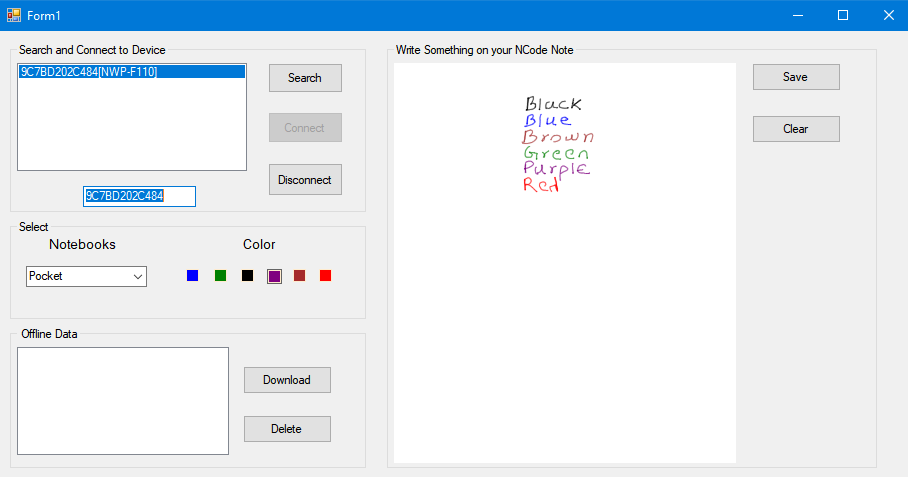

# Windows-Interface-for-Interacting-with-Neo-SmartPen-NWP-F110
This is a Desktop Interface for Interacting with the IOT device (Neo SmartPen) FWP-F110. You can write any content on NCode Notebooks and receive the strokes on the Desktop screen in real time via Bluetooth. If you are not connected to the Bluetooth the pen saves the written information in its memory and you can view the memory content of the pen anytime. You can even save the images on your Desktop.

## About NeoSmartPen
The Neo smartpen is designed to seamlessly integrate the real and digital worlds by transforming what you write on paper - everything from sketches and designs to business meeting notes - to your iOS, Android and Windows devices. It works in tandem with N notebooks, powered by NeoLAB Convergence’s patented Ncode™ technology and the accompanying application, Neo Notes. Find out more at www.neosmartpen.com

* Tutorial video - https://goo.gl/MQaVwY

## NCode Notebooks
There are a wide range of notebooks including pocket sized books, A4-sized paper pads, and stylish journals. Every notebook features NCodeTM technology that allows users to share their notes via email, directly from the page. Neo smartpen requires Ncoded notebooks. Ncodes are printed on every paper of N notebooks and provides signals that enable The Neo smartpen to trace handwriting.

## About Ncode™: service development guide
‘Natural Handwriting’ technology based on Ncode™(Microscopic data patterns containing various types of data) is a handwriting stroke recovery technology that digitizes paper coordinates obtained by optical pen devices such as Neo smartpen. The coordinates then can be used to store handwriting stroke information, analyzed to extract meaning based on user preferences and serve as the basis for many other types of services.

Click the link below to view a beginners guide to Ncode technology. << https://github.com/NeoSmartpen/Documentations/blob/master/Ncode™ Service Development Getting Started Guide v1.01.pdf >>

## Requirements
* Neo SmartPen
* NCode Notebooks

Interface supports Pen from Protcol v1 and Protocol v2.

## Dependencies
* InTheHand.Net.Personal.dll ( v3.5 )
* Ionic.Zip.Reduced.dll ( v1.9 )

## Interface

